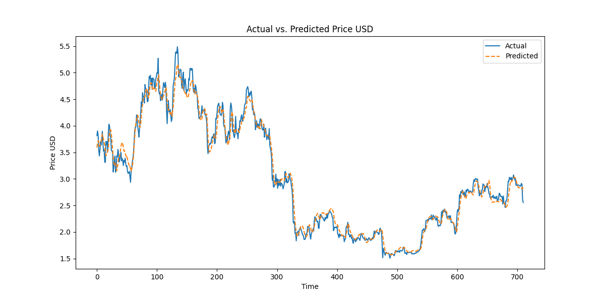

# DEMO LSTM - Прогнозирование Биткоина с использованием LSTM

## Описание
DEMO LSTM - это проект, использующий долгосрочную краткосрочную память (LSTM) для прогнозирования цен на биткоин. Проект автоматически собирает данные с биткоин сети, обрабатывает их и использует для обучения модели LSTM, реализованной с помощью Keras (TensorFlow).

## Функциональность
- Автоматический сбор данных с API блокчейна Биткоина.
- Предварительная обработка данных для обучения.
- Создание и обучение модели LSTM.
- Тестирование и оценка модели.
- Сохранение лучшей и последней моделей.

## Технологии
- Python
- Keras (TensorFlow)
- API Blockchain.info

## Установка и Запуск
Клонируйте репозиторий:
```bash
git clone [URL репозитория]
```
Установите зависимости:
```bash
pip install -r requirements.txt
```
Запустите скрипт:
```bash
python main.py
```

## Использование
Для запуска сбора данных и обучения модели выполните `main.py`. После завершения обучения результаты будут сохранены в соответствующие файлы.

## Структура Файлов
- `./best_model.tf`: Лучшая обученная модель.
- `./final_model.tf`: Последняя обученная модель.
- `test_results.txt`: Результаты тестирования модели.
- `plot.png`: График результатов тестирования.
- `training_history.npy`: История обучения модели.

## Тестирование и Результаты
Результаты тестирования модели и соответствующий график можно найти в файлах `test_results.txt` и `plot.png`.





Mean Squared Error (MSE): 0.019074815694770687

Mean Absolute Error (MAE): 0.10335305237451645
